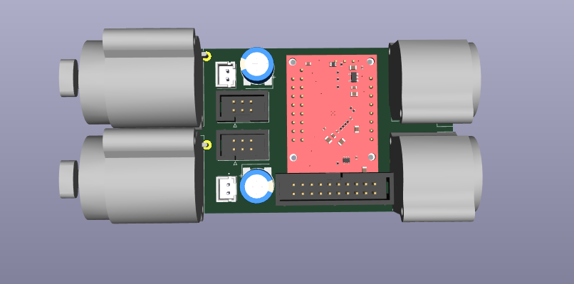
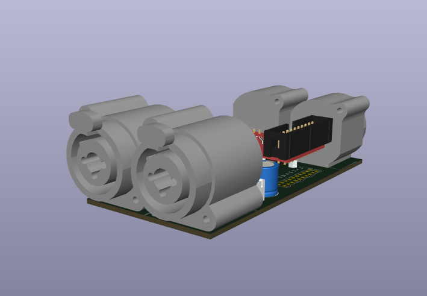
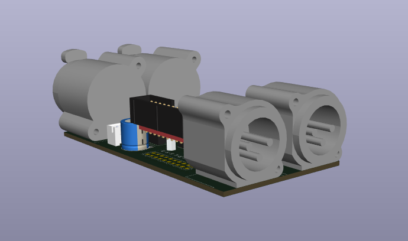

# T-DSP IO 2x2 Combo

**Part of the [T-DSP](https://t-dsp.com) open modular audio platform.**

A 2-in / 2-out balanced audio I/O backplane for the [T-DSP TAC5212 Pro Audio Module](https://github.com/t-dsp/t-dsp_tac5212_pro_audio_module), with combo (XLR/TRS) inputs and XLR balanced outputs.

## About T-DSP

T-DSP is an open modular audio platform designed for musicians, engineers, and developers who want powerful digital signal processing in a flexible, hackable format. Built around the [Teensy](https://www.pjrc.com/teensy/) microcontroller and the [Teensy Audio Library](https://www.pjrc.com/teensy/td_libs_Audio.html), T-DSP combines studio-quality audio with a growing library of open-source modules for mixing, synthesis, effects, and more.

Learn more at [t-dsp.com](https://t-dsp.com).

## Overview

This board is a **backplane** -- a carrier PCB that hosts the TAC5212 Pro Audio Module and provides all the connectors and signal routing needed for a complete stereo audio interface. The TAC5212 module connects to this board via headers (removable) or straight pins (permanent), and handles codec, filtering, and power regulation. The DSP I/O header connects to a Teensy (or any I2S/I2C-compatible microcontroller) via ribbon cable. The T-DSP Desktop Pro provides 2 buffered expansion headers to interface up to 4 modules per port.

### Inputs
- **2x Neutrik NCJ6FA-H combo jacks** -- accept XLR (balanced) or 1/4" TRS (balanced/unbalanced)
- Suitable for line-level signals (consumer -10dBV or professional +4dBu)
### Outputs
- **2x Neutrik NC3MAH XLR male connectors** -- balanced output
- Suitable for line-level output to studio monitors, mixers, or other pro audio equipment

### Preamp Mezzanine Headers
- **2x 2x3 IDC headers (2.54mm pitch)** -- one per input channel, breaks out the differential input signal path
- Designed for mounting an external preamp module as a mezzanine board
- Solder bridge passes signal through by default -- cut the trace to insert a preamp

### Phantom Power Headers
- **2x JST XH 2-pin connectors** -- one per input channel, for connecting an external +48V phantom power supply. A switchable phantom power module is on the T-DSP roadmap.

## Documents

- [Schematic PDF](documentation/t-dsp_io_2x2_combo-schematic.pdf)
- [Schematic (KiCanvas)](https://kicanvas.org/?github=https://github.com/t-dsp/t-dsp_io_2x2_combo/blob/main/t-dsp_io_2x2_combo.kicad_sch)
- [PCB Layout (KiCanvas)](https://kicanvas.org/?github=https://github.com/t-dsp/t-dsp_io_2x2_combo/blob/main/t-dsp_io_2x2_combo.kicad_pcb)
- [Interactive BOM](https://t-dsp.github.io/t-dsp_io_2x2_combo/bom/ibom.html)

## Project Files

| Directory | Contents |
|-----------|----------|
| `/bom/` | [Interactive BOM](https://t-dsp.github.io/t-dsp_io_2x2_combo/bom/ibom.html) |
| `/documentation/` | [Schematic PDF](documentation/t-dsp_io_2x2_combo-schematic.pdf) |
| `/lib_fp/` | Custom KiCad footprint and symbol libraries |

## Dependencies

- **[T-DSP TAC5212 Pro Audio Module](https://github.com/t-dsp/t-dsp_tac5212_pro_audio_module)** -- the codec module that mounts onto this backplane
- **[KiCad](https://www.kicad.org/)** 9.0+ to open and edit the design files

## Status

This board has not yet been built. If you build one, we'd love to hear how it goes -- please open an issue or reach out with your findings.

## Contact

For consulting, custom backplane design, or commercial licensing inquiries, reach out via [LinkedIn](https://linkedin.com/in/jayshoe).

## License

This project is licensed under the [Creative Commons Attribution-NonCommercial-ShareAlike 4.0 International (CC BY-NC-SA 4.0)](https://creativecommons.org/licenses/by-nc-sa/4.0/).

You are free to share and adapt this work for non-commercial purposes, as long as you give appropriate credit and distribute any derivatives under the same license.
